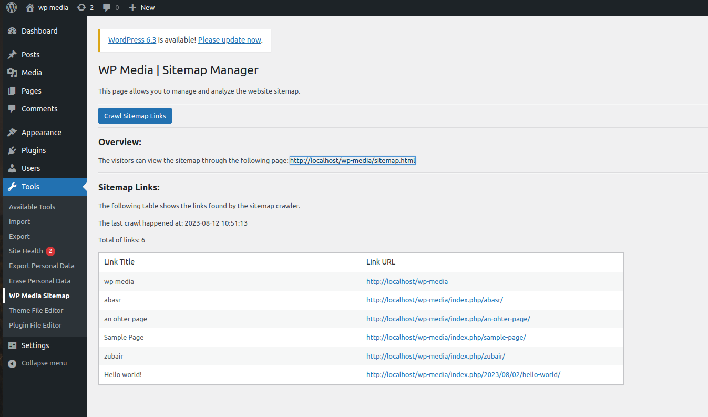

# WP Media Crawler


## Installing locally

This is a plugin WordPress, so you need to clone this repo into the WordPress plugins folder, enter the folder and run the following commands:

```
$ composer install
```

After that, you just need to activate the plugin in the WordPress Admin.

## Installing online


1. Install WP CLI and [WP CLI Dist Archive](https://developer.wordpress.org/cli/commands/dist-archive/).

2. Run the following command. It will generate a .zip in the previous folder (outside the plugin repo folder) with the name of the plugin. Use it to install the plugin into WordPress through the [Admin page](https://wordpress.org/documentation/article/manage-plugins/#upload-via-wordpress-admin).
	
	```
	$ composer build
	```

## Usage

The plugin will automatically run and schedule a task for crawling the home page links and create a sitemap.html. You can access it in 2 ways.

1. Public access. Just access your website DNS with the following path: `/sitemap.html`. If you get a 404 error, try the next step to make sure there are no errors.

2. Admin access. Through the submenu under the "Tools" menu (as shown below), you can see the sitemap table or run the crawler task manually.

	  
	